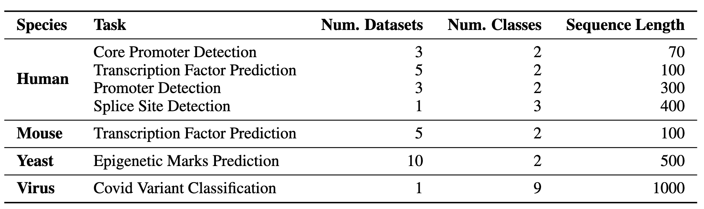
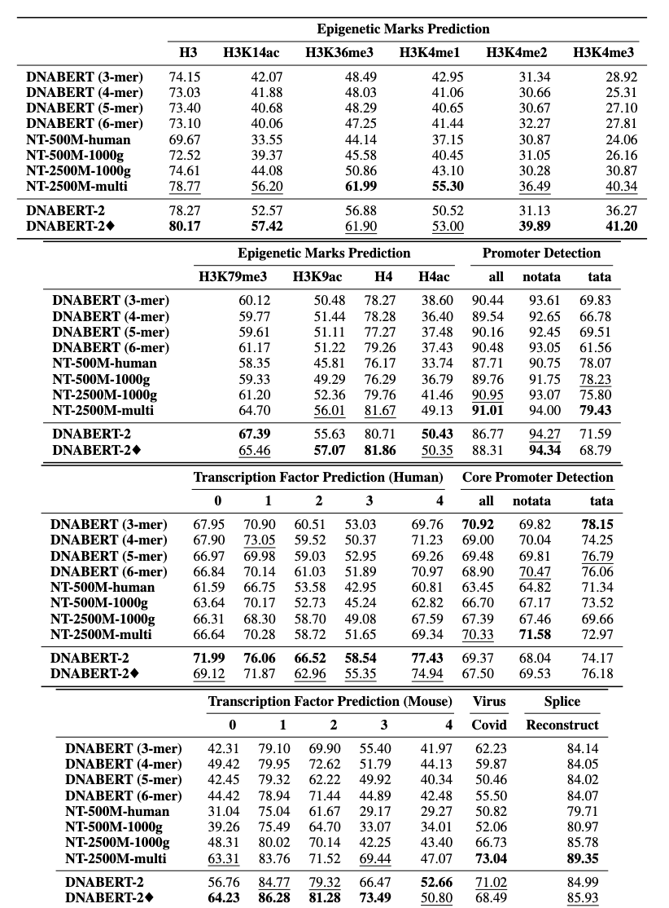

# DNABERT-2: Efficient Foundation Model and Benchmark for Multi-Species Genome

The repo contains: 

1. The official implementation of [DNABERT-2: Efficient Foundation Model and Benchmark for Multi-Species Genome](https://arxiv.org/abs/2306.15006)
2. Genome Understanding Evaluation (GUE): a comprehensize benchmark containing 28 datasets for multi-species genome understanding benchmark.


## Contents

- [1. Introduction](#1-introduction)
- [2. Model and Data](#2-model-and-data)
- [3. Setup Environment](#3-setup-environment)
- [4. Quick Start](#4-quick-start)
- [5. Pre-Training](#5-pre-training)
- [6. Finetune](#6-finetune)
- [7. Citation](#7-citation)


## 1. Introduction

DNABERT-2 is a foundation model trained on large-scale multi-species genome that achieves the state-of-the-art performanan on $28$ tasks of the GUE benchmark. It replaces k-mer tokenization with BPE, positional embedding with Attention with Linear Bias (ALiBi), and incorporate other techniques to improve the efficiency and effectiveness of DNABERT.


## 2. Model and Data

The pre-trained models is available at Huggingface as `zhihan1996/DNABERT-2-117M`. [Link to HuggingFace ModelHub](https://huggingface.co/zhihan1996/DNABERT-2-117M). [Link For Direct Downloads]().


### 2.1 GUE: Genome Understanding Evaluation

GUE is a comprehensive benchmark for genome understanding consising of $28$ distinct datasets across $7$ tasks and $4$ species. GUE can be download [here](https://drive.google.com/file/d/1GRtbzTe3UXYF1oW27ASNhYX3SZ16D7N2/view?usp=sharing). Statistics and model performances on GUE is shown as follows:








## 3. Setup environment

    # create and activate virtual python environment
    conda create -n dna python=3.8
    conda activate dna
    
    # (optional if you would like to use flash attention)
    # install triton from source
    git clone https://github.com/openai/triton.git;
    cd triton/python;
    pip install cmake; # build-time dependency
    pip install -e .
    
    # install required packages
    python3 -m pip install -r requirements.txt


## 4. Quick Start

Our model is easy to use with the [transformers](https://github.com/huggingface/transformers) package.


To load the model from huggingface:
```python
import torch
from transformers import AutoTokenizer, AutoModel

tokenizer = AutoTokenizer.from_pretrained("zhihan1996/DNABERT-2-117M", trust_remote_code=True)
model = AutoModel.from_pretrained("zhihan1996/DNABERT-2-117M", trust_remote_code=True)
```


To calculate the embedding of a dna sequence
```
dna = "ACGTAGCATCGGATCTATCTATCGACACTTGGTTATCGATCTACGAGCATCTCGTTAGC"
inputs = tokenizer(dna, return_tensors = 'pt')["input_ids"]
hidden_states = model(inputs)[0] # [1, sequence_length, 768]

# embedding with mean pooling
embedding_mean = torch.mean(hidden_states[0], dim=0)
print(embedding_mean.shape) # expect to be 768

# embedding with max pooling
embedding_max = torch.max(hidden_states[0], dim=0)[0]
print(embedding_max.shape) # expect to be 768
```


## 5. Pre-Training

Codes for pre-training is coming soon.


## 6. Finetune

### 6.1 Evaluate models on GUE
Please first download the GUE dataset from [here](https://drive.google.com/file/d/1GRtbzTe3UXYF1oW27ASNhYX3SZ16D7N2/view?usp=sharing). Then run the scripts to evaluate on all the tasks. 

Current script is set to use `DataParallel` for training on 4 GPUs. If you have different number of GPUs, please change the `per_device_train_batch_size` and `gradient_accumulation_steps` accordingly to adjust the global batch size to 32 to replicate the results in the paper. If you would like to perform distributed multi-gpu training (e.g., with `DistributedDataParallel`), simply change `python` to `torchrun --nproc_per_node ${n_gpu}`.


```
export DATA_PATH=/path/to/GUE #(e.g., /home/user)
cd finetune

# Evaluate DNABERT-2 on GUE
sh scripts/run_dnabert2.sh DATA_PATH

# Evaluate DNABERT (e.g., DNABERT with 3-mer) on GUE
# 3 for 3-mer, 4 for 4-mer, 5 for 5-mer, 6 for 6-mer
sh scripts/run_dnabert1.sh DATA_PATH 3

# Evaluate Nucleotide Transformers on GUE
# 0 for 500m-1000g, 1 for 500m-human-ref, 2 for 2.5b-1000g, 3 for 2.5b-multi-species
sh scripts/run_nt.sh DATA_PATH 0

```

### 6.2 Fine-tune DNABERT2 on your own datasets

Here we provide an example of fine-tuning DNABERT2 on your own datasets.


#### 6.2.1 Format your dataset

First, please generate 3 `csv` files from your dataset: `train.csv`, `dev.csv`, and `test.csv`. In the training process, the model is trained on `train.csv` and is evaluated on the `dev.csv` file. After the training if finished, the checkpoint with the smallest loss on the `dev.csv `file is loaded and be evaluated on `test.csv`. If you do not have a validation set, please just make the `dev.csv` and `test.csv` the same. 


Please see the `sample_data` folder for an sample of data format. Each file should be in the same format, with the first row as document head named `sequence, label`. Each following row should contain a DNA sequence and a numerical label concatenated by a `,` (e.g., `ACGTCAGTCAGCGTACGT, 1 `).


Then, you are able to finetune DNABERT-2 on your own dataset with the following code:


```
cd finetune

export DATA_PATH=$path/to/data/folder  # e.g., ./sample_data
export MAX_LENGTH=100 # Please set the number as 0.25 * your sequence length. 
											# e.g., set it as 250 if your DNA sequences have 1000 nucleotide bases
											# This is because the tokenized will reduce the sequence length by about 5 times
export LR=3e-5

# Training use DataParallel
python train.py \
    --model_name_or_path zhihan1996/DNABERT-2-117M \
    --data_path  ${DATA_PATH} \
    --kmer -1 \
    --run_name DNABERT2_${DATA_PATH} \
    --model_max_length ${MAX_LENGTH} \
    --per_device_train_batch_size 8 \
    --per_device_eval_batch_size 16 \
    --gradient_accumulation_steps 1 \
    --learning_rate ${LR} \
    --num_train_epochs 5 \
    --fp16 \
    --save_steps 200 \
    --output_dir output/dnabert2 \
    --evaluation_strategy steps \
    --eval_steps 200 \
    --warmup_steps 50 \
    --logging_steps 100 \
    --overwrite_output_dir True \
    --log_level info \
    --find_unused_parameters False
    
# Training use DistributedDataParallel (more efficient)
export num_gpu=4 # please change the value based on your setup

torchrun --nproc-per-node=${num_gpu} train.py \
    --model_name_or_path zhihan1996/DNABERT-2-117M \
    --data_path  ${DATA_PATH} \
    --kmer -1 \
    --run_name DNABERT2_${DATA_PATH} \
    --model_max_length ${MAX_LENGTH} \
    --per_device_train_batch_size 8 \
    --per_device_eval_batch_size 16 \
    --gradient_accumulation_steps 1 \
    --learning_rate ${LR} \
    --num_train_epochs 5 \
    --fp16 \
    --save_steps 200 \
    --output_dir output/dnabert2 \
    --evaluation_strategy steps \
    --eval_steps 200 \
    --warmup_steps 50 \
    --logging_steps 100 \
    --overwrite_output_dir True \
    --log_level info \
    --find_unused_parameters False
```


## 7. Citation

If you have any question regarding our paper or codes, please feel free to start an issue or email Zhihan Zhou (zhihanzhou2020@u.northwestern.edu).


If you use DNABERT-2 in your work, please kindly cite our paper:

**DNABERT-2**

```
@misc{zhou2023dnabert2,
      title={DNABERT-2: Efficient Foundation Model and Benchmark For Multi-Species Genome}, 
      author={Zhihan Zhou and Yanrong Ji and Weijian Li and Pratik Dutta and Ramana Davuluri and Han Liu},
      year={2023},
      eprint={2306.15006},
      archivePrefix={arXiv},
      primaryClass={q-bio.GN}
}
```

**DNABERT**

```
@article{ji2021dnabert,
    author = {Ji, Yanrong and Zhou, Zhihan and Liu, Han and Davuluri, Ramana V},
    title = "{DNABERT: pre-trained Bidirectional Encoder Representations from Transformers model for DNA-language in genome}",
    journal = {Bioinformatics},
    volume = {37},
    number = {15},
    pages = {2112-2120},
    year = {2021},
    month = {02},
    issn = {1367-4803},
    doi = {10.1093/bioinformatics/btab083},
    url = {https://doi.org/10.1093/bioinformatics/btab083},
    eprint = {https://academic.oup.com/bioinformatics/article-pdf/37/15/2112/50578892/btab083.pdf},
}
```

